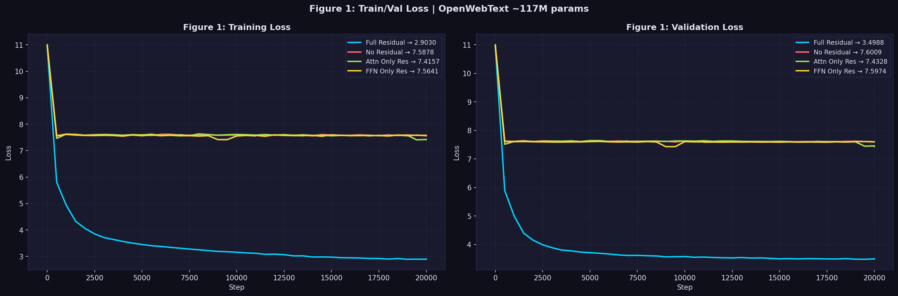
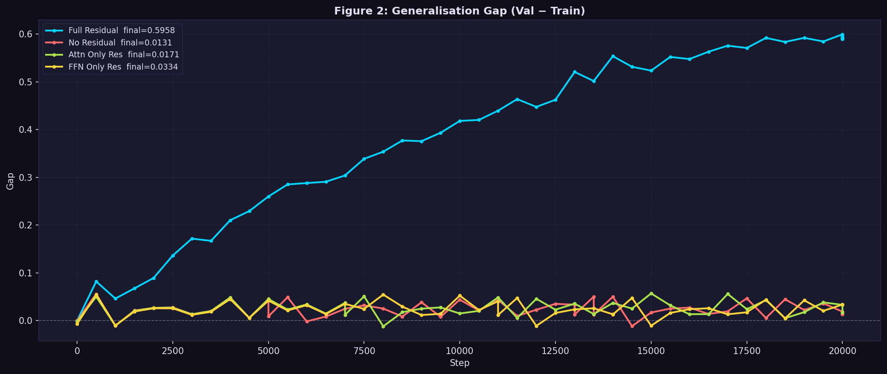
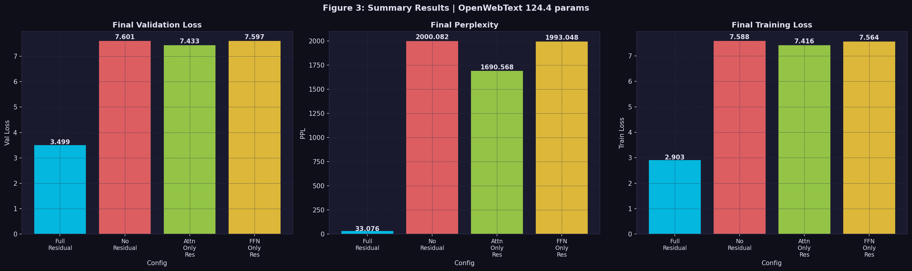
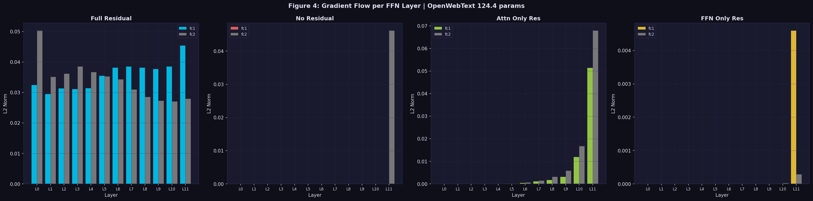
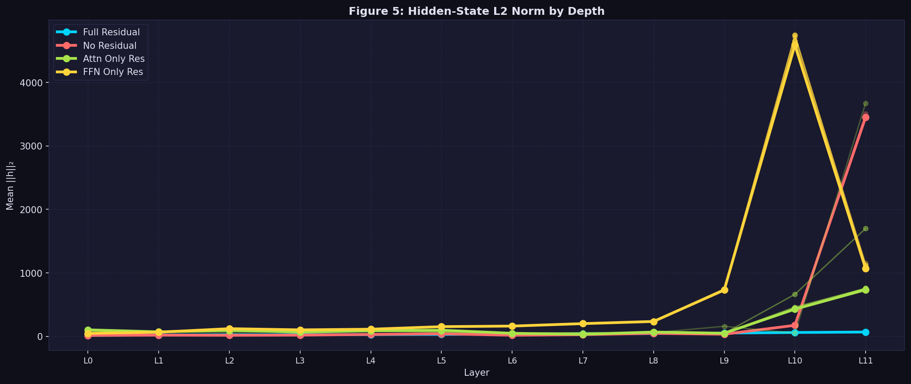

# Why Partial Residual Connections Fail


## Abstract

Residual connections are a fundamental component of transformer architectures, yet it remains unclear whether the residual pathway around the attention block and the residual pathway around the feed-forward network (FFN) contribute independently to optimization.

I investigate this question through controlled ablation studies on GPT-style language models trained on OpenWebText at approximately 10M and 124.4M parameters.

Across both scales, removing either the attention residual pathway or the FFN residual pathway causes severe performance degradation. At 124.4M parameters, the Full Residual model achieves a validation perplexity of 33.1, while Attention-Only, FFN-Only, and No Residual variants degrade to approximately 1690–2000 perplexity. Similar qualitative behavior is observed at 10M parameters.

These results suggest that transformer residual pathways may function as a coupled optimization mechanism rather than independent architectural components. We further analyze gradient flow, hidden-state dynamics, and activation statistics to investigate potential explanations for this behavior.

---

## Overview

Residual connections are a defining component of modern transformer architectures, yet it remains unclear whether the residual pathway around the attention block and the residual pathway around the feed-forward network (FFN) contribute independently to optimization.

This project investigates that question through a controlled ablation study on GPT-style language models trained on OpenWebText.

The central question is:

> If one residual pathway is preserved, can a transformer still train effectively?

To answer this, I trained transformer models at two scales (~10M and ~124.4M parameters) under four residual configurations and analyzed their optimization dynamics, activation statistics, gradient flow, and hidden-state behavior.

---

## Research Question

Are the attention and FFN residual pathways independently sufficient for transformer optimization?

Or do both pathways need to work together to support effective gradient propagation and learning?

---

## Experimental Setup

### Dataset

* OpenWebText

### Model Scales

#### Small Scale

* ~10M parameters
* 6 transformer layers

#### Medium Scale

* ~124.4M parameters
* 12 transformer layers
* Hidden size: 768
* 12 attention heads

### Configurations Evaluated

1. Full Residual
2. No Residual
3. Attention-Only Residual
4. FFN-Only Residual

### Training

* AdamW optimizer
* Cosine learning-rate decay
* Gradient accumulation
* Mixed precision training
* GPT-2 tokenizer (50,257 vocabulary)

---

## Main Finding

The most surprising result was that preserving only one residual pathway provided almost no benefit over removing both.

I initially expected the Attention-Only and FFN-Only variants to retain at least part of the performance of the Full Residual architecture.

Instead, both variants converged to nearly the same loss range as the fully residual-free model.

---

## Cross-Scale Validation

To determine whether the result was specific to a single model size, I repeated the experiment at two scales.

| Scale  | Parameters | Observation                    |
| ------ | ---------- | ------------------------------ |
| Small  | ~10M       | Partial residual variants fail |
| Medium | ~124.4M    | Partial residual variants fail |

Across both scales:

* Full Residual models trained successfully.
* Attention-Only Residual models failed to recover performance.
* FFN-Only Residual models failed to recover performance.
* Removing either residual pathway produced behavior much closer to the fully residual-free model than the Full Residual model.

This suggests the phenomenon is not unique to a single model scale.

---

## 10M Parameter Results

| Configuration           | Validation Loss | Perplexity | Training Loss |
| ----------------------- | --------------- | ---------- | ------------- |
| Full Residual           | 1.4751          | 4.4        | 1.1297        |
| No Residual             | 3.3523          | 28.6       | 3.3153        |
| Attention Only Residual | 3.3534          | 28.6       | 3.3161        |
| FFN Only Residual       | 3.3475          | 28.5       | 3.3121        |

## 124.4M Parameter Results

| Configuration           | Validation Loss | Perplexity | Training Loss |
| ----------------------- | --------------- | ---------- | ------------- |
| Full Residual           | 3.4988          | 33.1       | 2.9030        |
| No Residual             | 7.6009          | 2000.1     | 7.5878        |
| Attention Only Residual | 7.4328          | 1690.6     | 7.4157        |
| FFN Only Residual       | 7.5974          | 1993.0     | 7.5641        |


---

## Key Figures

### Cross-Scale Summary


| Scale              | Full Residual | No Residual | Attention Only | FFN Only |
|--------------------|---------------|-------------|----------------|----------|
| ~10M Parameters    | 1.4751        | 3.3523      | 3.3534         | 3.3475   |
| ~124.4M Parameters | 3.4988        | 7.6009      | 7.4328         | 7.5974   |


| Scale              | No Residual | Attention Only | FFN Only |
|--------------------|-------------|----------------|----------|
| ~10M Parameters    | 2.27× worse | 2.27× worse    | 2.27× worse |
| ~124.4M Parameters | 2.17× worse | 2.12× worse    | 2.17× worse |

Across both scales, preserving only the attention residual pathway or only the FFN residual pathway provides little benefit over removing both residual pathways entirely.

The degradation relative to the Full Residual baseline remains remarkably consistent. At ~10M parameters, all three ablated variants exhibit approximately 2.27× higher validation loss than the Full Residual model. At ~124.4M parameters, the degradation remains between 2.12× and 2.17×.

Most notably, the Attention-Only and FFN-Only variants consistently behave much more like the fully residual-free model than the Full Residual model. This pattern appears at both scales despite a more than 12× increase in parameter count.

These results suggest that attention and FFN residual pathways do not function as independent optimization aids. Instead, both pathways appear to work together as a coupled mechanism supporting effective gradient propagation and stable optimization.


### 124M Training and Validation Loss



### 124M Generalization Gap



### 124M Summary Results



### 124M Gradient Flow



### 124M Hidden-State Norm Dynamics



---

## Why This Happens — A Working Hypothesis

The gradient-flow analysis suggests that residual pathways act as the primary mechanism for propagating optimization signals through depth.

When either residual pathway is removed:

* Early-layer gradients become substantially weaker.
* Hidden-state norms become significantly larger.
* Optimization behavior becomes similar to the fully residual-free model.

One possible interpretation is that attention and FFN residual pathways function as complementary gradient highways. Removing either pathway disrupts the optimization dynamics sufficiently to cause a dramatic performance collapse.

This hypothesis remains under investigation and motivates future mechanistic analysis.

---

## Hardware Requirements

### 10M Parameter Study

* GPU: RTX 3090 / A100 recommended
* VRAM: 12GB+
* Training Time: ~1–2 hours

### 124.4M Parameter Study

* GPU: A100 40GB recommended
* VRAM: 40GB+
* Training Time: ~10 - ~15 hours per configuration
* Disk Space: ~10GB+

Actual training times may vary depending on hardware and batch size.

---

## Repository Structure

```text
residual-connections-gpt/
│
├── config.py
├── data.py
├── model.py
├── train.py
├── plot_results.py
│
├── notebooks/
│   ├── Residual_Experiment_10M.ipynb
│   └── Residual_Experiment_124M.ipynb
│
├── results/
│   ├── residual_results_10M.json
│   └── residual_results_124M.json
│
└── figures/
    ├── 10M/
    └── 124M/
```

---

## Reproducibility

### Install Dependencies

```bash
pip install -r requirements.txt
```

### Run All Experiments

```bash
bash run_all.sh
```

### Generate Figures

```bash
python plot_results.py
```

---

## Results Included

The repository includes:

* Source code
* Publication-quality figures
* Experiment outputs
* Original notebooks
* Reproducibility scripts

Running the training and plotting scripts will regenerate the reported figures and results.

---

## Future Work

* Mechanistic investigation of residual-path failure
* Larger-scale replication (350M+ parameters)
* Alternative transformer architectures
* Additional datasets
* Circuit-level analysis of residual information flow

---

## Citation

```bibtex
@misc{babariya2026residual,
  title={Why Partial Residual Connections Fail},
  author={Pratikkumar Babariya},
  year={2026}
}
```

---

## Paper

**arXiv:** Coming soon.

---

## Conclusion

Across both approximately 10M and 124.4M parameter GPT-style language models, preserving only the attention residual pathway or only the FFN residual pathway was insufficient to maintain strong performance.

The Attention-Only and FFN-Only variants consistently behaved much more like the fully residual-free model than the Full Residual model.

These results suggest that transformer residual pathways may function as a coupled optimization mechanism rather than independent architectural components.
